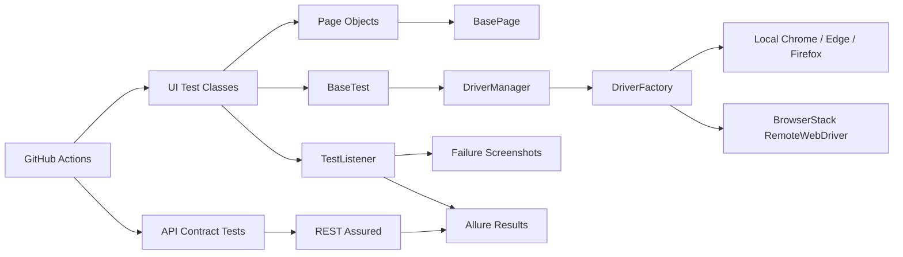

# QA Automation Portfolio — Selenium · Java · TestNG · REST Assured

[](https://github.com/mromanowski832-ctrl/qa-automation-portfolio/actions/workflows/qa.yml)

Production-style QA automation portfolio covering browser UI regression, API contract testing, parallel-safe driver management, cloud execution and CI evidence.

This repository is designed as a practical engineering portfolio rather than a collection of isolated WebDriver examples. The framework separates test intent from browser mechanics, supports local and BrowserStack execution, generates failure evidence, produces Allure-compatible results and runs automated validation in GitHub Actions.

## Portfolio case studies — verified implementation

**Michał Romanowski · QA automation portfolio**

This is one framework with three engineering case studies, not three independent commercial projects. The application under test is SauceDemo; the API target is JSONPlaceholder. Both are demonstration services.

### 1. Commerce Journey — cross-browser purchase validation

**Problem:** a purchase journey must remain testable across browsers, including the customer-details form and final confirmation.

**Implementation:** Selenium page objects drive login, adding a backpack, cart inspection, customer details, order overview and purchase completion. Assertions check the cart badge, item count, product identity, displayed total and final confirmation.

**Evidence:** [PurchaseFlowTests.java](src/test/java/pl/luzmen/qa/tests/PurchaseFlowTests.java) · [page objects](src/test/java/pl/luzmen/qa/pages) · [Chrome and Firefox CI](.github/workflows/qa.yml).

**Boundary:** the current test checks that a total is displayed; it does not yet prove pricing arithmetic, real payments or production conversion rates.

### 2. API Contract Lab — independent HTTP validation

**Problem:** API checks should run independently of browser setup and identify response-contract regressions.

**Implementation:** two REST Assured tests validate a single post and a filtered posts collection. Checks cover HTTP 200, JSON content type, known identifiers, required non-null fields and a non-empty collection. Requests and responses are connected to Allure.

**Evidence:** [ApiContractTests.java](src/test/java/pl/luzmen/qa/api/ApiContractTests.java).

**Boundary:** this is a small public demo-API suite, not a complete API certification or security audit. Filtering currently checks the first returned item's user ID, not every item.

### 3. CI Evidence Pipeline — reproducible review

**Problem:** a recruiter needs executable evidence, not only a technology list.

**Implementation:** GitHub Actions runs two UI jobs (Chrome and Firefox) and a separate API job. Reports and Allure results are uploaded even when tests fail; UI failure screenshots are uploaded on failure. Artifact retention is 14 days.

**Evidence:** [workflow source](.github/workflows/qa.yml) · [all workflow runs](https://github.com/mromanowski832-ctrl/qa-automation-portfolio/actions).

### Verified baseline

Run [#42](https://github.com/mromanowski832-ctrl/qa-automation-portfolio/actions/runs/34279544203), completed **8 September 2026**, validated commit `fb02db279c8016522aabc83a81dcaecc6fafedd7`:

| CI job | Recorded conclusion |
| --- | --- |
| UI regression — Chrome | Success |
| UI regression — Firefox | Success |
| API contract — REST Assured | Success |

This is historical evidence for that exact commit, not a promise that future runs will pass. Earlier failed runs remain visible. Three successful jobs do not mean three tests; see the run reports for individual test counts. BrowserStack and Edge execution are supported by the framework but are not verified by this run.

### LinkedIn Featured description

**QA Automation Portfolio | Selenium, Java, REST Assured & GitHub Actions**

Personal engineering project demonstrating an end-to-end shopping journey, independent API contract checks, and cross-browser CI in Chrome and Firefox. Built with Page Object Model, TestNG groups, Allure integration and failure evidence. Includes source code and a linked successful CI baseline. Uses public demonstration services; not presented as commercial client work.

---

## Recruiter snapshot

- Java 21
- Selenium WebDriver 4.48.0
- TestNG 7.12.0
- REST Assured 6.0.1
- Maven Surefire 3.6.0
- Page Object Model
- ThreadLocal WebDriver lifecycle
- Chrome, Edge and Firefox support
- BrowserStack Automate integration
- Allure TestNG + REST Assured integration
- GitHub Actions cross-browser CI
- smoke and regression group separation
- data-driven tests with TestNG DataProvider
- failure screenshots and CI artifacts

## Architecture



## UI test coverage

The SauceDemo UI regression validates:

- successful authentication
- locked-user behavior
- data-driven invalid credential scenarios
- logout
- product sorting
- cart badge consistency
- add/remove product behavior
- complete checkout flow
- final order confirmation

## API contract coverage

The REST Assured layer validates a public JSON API independently from WebDriver. Current checks include:

- HTTP status contracts
- JSON content type
- response field values
- required response fields
- query-parameter filtering
- non-empty collection assertions

REST Assured requests and responses are connected to the Allure adapter so API evidence is available in generated results.

## Modern test selection with Surefire groups

Surefire 3.6.0 no longer supports TestNG `suiteXmlFiles`. This project therefore uses explicit TestNG groups instead of deprecated XML-suite selection.

The group model is intentionally separated by layer:

- `ui-smoke`
- `ui-regression`
- `api-smoke`
- `api-regression`

This prevents an API-only CI job from accidentally starting WebDriver sessions and keeps pipeline responsibilities isolated.

## Run UI smoke tests

```powershell
mvn clean test -Dtest.groups=ui-smoke
```

The UI smoke layer covers the highest-value paths:

- successful login
- cart manipulation
- complete purchase flow

## Run UI regression

UI regression is the default Maven test group:

```powershell
mvn clean test
```

Equivalent explicit command:

```powershell
mvn clean test -Dtest.groups=ui-regression
```

## Run API tests

API regression runs without starting a browser:

```powershell
mvn clean test -Dtest.groups=api-regression
```

API smoke only:

```powershell
mvn clean test -Dtest.groups=api-smoke
```

## Engineering decisions

### Explicit synchronization only

Implicit waits are disabled. Synchronization is handled through explicit waits in the page layer, keeping timeout behavior deterministic and avoiding mixed-wait side effects.

### Parallel-safe WebDriver lifecycle

`ThreadLocal<WebDriver>` isolates browser sessions per TestNG execution thread. Every UI test method receives a fresh browser session and is cleaned up after execution.

### Page Object Model

Selectors and browser interaction logic live inside page objects. Test classes describe business scenarios instead of low-level WebDriver operations.

### Data-driven negative testing

TestNG `@DataProvider` is used for credential combinations so additional negative cases can be added without duplicating test logic.

### Failure evidence

On UI failure, the TestNG listener captures a timestamped PNG screenshot. Evidence is written to `screenshots/`, attached to Allure when possible, and uploaded from GitHub Actions on failed runs.

### Local and cloud execution

The same UI framework can run:

- locally in Chrome
- locally in Microsoft Edge
- locally in Firefox
- remotely in BrowserStack Automate

BrowserStack credentials are supplied through environment variables. No BrowserStack secrets are stored in source control.

## Project structure

```text
.
├── .github/
│   └── workflows/
│       └── qa.yml
├── src/
│   └── test/
│       ├── java/pl/luzmen/qa/
│       │   ├── api/
│       │   ├── config/
│       │   ├── core/
│       │   ├── driver/
│       │   ├── listeners/
│       │   ├── pages/
│       │   └── tests/
│       └── resources/
│           └── config.properties
├── .gitignore
├── CHANGELOG.md
├── LICENSE
├── pom.xml
└── README.md
```

## Run locally

Requirements:

- JDK 21
- Maven 3.6.3+
- Chrome, Microsoft Edge or Firefox for UI groups

Default configuration uses Microsoft Edge:

```powershell
mvn clean test
```

Run the full UI regression in Chrome:

```powershell
mvn clean test -Dtest.groups=ui-regression -Dbrowser=chrome
```

Run headless Edge:

```powershell
mvn clean test -Dtest.groups=ui-regression -Dbrowser=edge -Dheadless=true
```

Run Firefox:

```powershell
mvn clean test -Dtest.groups=ui-regression -Dbrowser=firefox
```

Selenium Manager resolves browser drivers automatically.

## Run on BrowserStack

Set credentials as environment variables:

```powershell
$env:BROWSERSTACK_USERNAME="your_username"
$env:BROWSERSTACK_ACCESS_KEY="your_access_key"
mvn clean test -Dtest.groups=ui-regression -Drun.mode=browserstack -Dbrowser=edge -Dheadless=false
```

The framework sends project/build metadata to BrowserStack and marks remote sessions as passed or failed through the BrowserStack executor.

## Allure reporting

Test execution writes Allure-compatible results to:

```text
target/allure-results/
```

Generate and open a local report:

```powershell
mvn allure:serve
```

Generate a static report:

```powershell
mvn allure:report
```

The Maven integration generates the static report under `target/site/`.

## Configuration priority

Runtime configuration is resolved in this order:

1. JVM system property (`-Dkey=value`)
2. environment variable (`KEY_NAME`)
3. `src/test/resources/config.properties`
4. framework default

Examples:

```powershell
mvn clean test -Dtest.groups=ui-smoke -Dbrowser=chrome -Dheadless=true
mvn clean test -Dtest.groups=ui-regression -Drun.mode=browserstack -Dbrowser=edge
mvn clean test -Dtest.groups=api-regression
```

## CI pipeline

GitHub Actions validates independent layers:

1. UI regression in a browser matrix:
   - Chrome
   - Firefox
2. API contract regression with REST Assured

The UI jobs run in parallel and use Java 21, Maven and headless browsers. TestNG/Surefire reports and Allure results are retained as workflow artifacts. Failure screenshots are uploaded separately when a UI job fails.

## Quality rules

- no `Thread.sleep()`
- no implicit waits
- no hardcoded local driver paths
- no credentials committed to source control
- independent UI tests
- fresh browser session per UI test
- explicit page-load assertions
- stable selectors where the application exposes IDs or `data-test`
- screenshot evidence on UI failures
- isolated UI and API test groups
- separate smoke and regression layers
- CI-ready execution
- optional BrowserStack cloud-grid execution

## Author

**Michał Romanowski**  
AI Tester · QA Automation · Selenium · Java · TestNG · BrowserStack · AI Evaluation

Built as a practical QA automation portfolio project under **LuzMen**.
