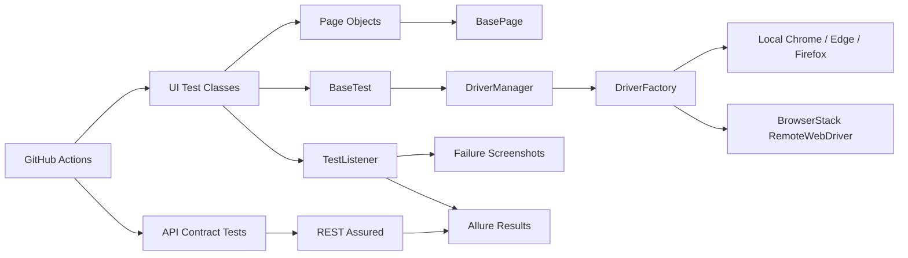

# QA Automation Portfolio — Selenium · Java · TestNG · REST Assured

[](https://github.com/mromanowski832-ctrl/qa-automation-portfolio/actions/workflows/qa.yml)

Production-style QA automation portfolio covering browser UI regression, API contract testing, parallel-safe driver management, cloud execution and CI evidence.

This repository is designed as a practical engineering portfolio rather than a collection of isolated WebDriver examples. The framework separates test intent from browser mechanics, supports local and BrowserStack execution, generates failure evidence, produces Allure-compatible results and runs automated validation in GitHub Actions.

## Recruiter snapshot

- Java 21
- Selenium WebDriver 4.48.0
- TestNG 7.12.0
- REST Assured 6.0.1
- Maven
- Page Object Model
- ThreadLocal WebDriver lifecycle
- Chrome, Edge and Firefox support
- BrowserStack Automate integration
- Allure TestNG + REST Assured integration
- GitHub Actions cross-browser CI
- Smoke and regression suites
- Data-driven tests with TestNG DataProvider
- Failure screenshots and CI artifacts

## Architecture



## UI test coverage

The SauceDemo regression suite validates:

- successful authentication
- locked-user behavior
- data-driven invalid credential scenarios
- logout
- product sorting
- cart badge consistency
- add/remove product behavior
- complete checkout flow
- final order confirmation

## API contract coverage

The REST Assured suite validates a public JSON API independently from WebDriver. Current checks include:

- HTTP status contracts
- JSON content type
- response field values
- required response fields
- query-parameter filtering
- non-empty collection assertions

REST Assured requests and responses are connected to the Allure adapter so API evidence is available in generated test results.

## Test strategy

### Smoke

The smoke suite contains the highest-value paths required to prove that the application is usable:

- successful login
- cart manipulation
- complete purchase flow

Run it with:

```powershell
mvn clean test -DsuiteXmlFile=testng-smoke.xml
```

### UI regression

The default suite runs the complete browser regression set:

```powershell
mvn clean test
```

Equivalent explicit command:

```powershell
mvn clean test -DsuiteXmlFile=testng.xml
```

### API contract

Run API tests without starting a browser:

```powershell
mvn clean test -DsuiteXmlFile=testng-api.xml
```

## Engineering decisions

### Explicit synchronization only

Implicit waits are disabled. Synchronization is handled through explicit waits in the page layer, keeping timeout behavior deterministic and avoiding mixed-wait side effects.

### Parallel-safe WebDriver lifecycle

`ThreadLocal<WebDriver>` isolates browser sessions per TestNG execution thread. Every UI test method receives a fresh browser session and is cleaned up after execution.

### Page Object Model

Selectors and browser interaction logic live inside page objects. Test classes describe business scenarios instead of low-level WebDriver operations.

### Data-driven negative testing

TestNG `@DataProvider` is used for credential combinations so additional negative cases can be added without duplicating test logic.

### Failure evidence

On UI failure, the TestNG listener captures a timestamped PNG screenshot. Evidence is written to `screenshots/`, attached to Allure when possible, and uploaded from GitHub Actions on failed runs.

### Local and cloud execution

The same UI framework can run:

- locally in Chrome
- locally in Microsoft Edge
- locally in Firefox
- remotely in BrowserStack Automate

BrowserStack credentials are supplied through environment variables. No BrowserStack secrets are stored in source control.

## Project structure

```text
.
├── .github/
│   └── workflows/
│       └── qa.yml
├── src/
│   └── test/
│       ├── java/pl/luzmen/qa/
│       │   ├── api/
│       │   ├── config/
│       │   ├── core/
│       │   ├── driver/
│       │   ├── listeners/
│       │   ├── pages/
│       │   └── tests/
│       └── resources/
│           └── config.properties
├── .gitignore
├── CHANGELOG.md
├── LICENSE
├── pom.xml
├── README.md
├── testng-api.xml
├── testng-smoke.xml
└── testng.xml
```

## Run locally

Requirements:

- JDK 21
- Maven 3.6.3+
- Chrome, Microsoft Edge or Firefox for UI suites

Default configuration uses Microsoft Edge:

```powershell
mvn clean test
```

Run in Chrome:

```powershell
mvn clean test -Dbrowser=chrome
```

Run headless:

```powershell
mvn clean test -Dbrowser=edge -Dheadless=true
```

Run Firefox:

```powershell
mvn clean test -Dbrowser=firefox
```

Selenium Manager resolves browser drivers automatically.

## Run on BrowserStack

Set credentials as environment variables:

```powershell
$env:BROWSERSTACK_USERNAME="your_username"
$env:BROWSERSTACK_ACCESS_KEY="your_access_key"
mvn clean test -Drun.mode=browserstack -Dbrowser=edge -Dheadless=false
```

The framework sends project/build metadata to BrowserStack and marks remote sessions as passed or failed through the BrowserStack executor.

## Allure reporting

Test execution writes Allure-compatible results to:

```text
target/allure-results/
```

Generate and open a local report:

```powershell
mvn allure:serve
```

Generate a static report:

```powershell
mvn allure:report
```

The Maven integration generates the static report under `target/site/`.

## Configuration priority

Runtime configuration is resolved in this order:

1. JVM system property (`-Dkey=value`)
2. environment variable (`KEY_NAME`)
3. `src/test/resources/config.properties`
4. framework default

Examples:

```powershell
mvn clean test -Dbrowser=chrome -Dheadless=true
mvn clean test -Drun.mode=browserstack -Dbrowser=edge
mvn clean test -DsuiteXmlFile=testng-smoke.xml -Dbrowser=firefox -Dheadless=true
```

## CI pipeline

GitHub Actions validates two independent layers:

1. UI regression in a browser matrix:
   - Chrome
   - Firefox
2. API contract tests with REST Assured

The UI jobs run in parallel and use Java 21, Maven and headless browsers. TestNG/Surefire reports and Allure results are retained as workflow artifacts. Failure screenshots are uploaded separately when a UI job fails.

## Quality rules

- no `Thread.sleep()`
- no implicit waits
- no hardcoded local driver paths
- no credentials committed to source control
- independent UI tests
- fresh browser session per UI test
- explicit page-load assertions
- stable selectors where the application exposes IDs or `data-test`
- screenshot evidence on UI failures
- dedicated smoke and regression suites
- separate browser and API validation layers
- CI-ready execution
- optional BrowserStack cloud-grid execution

## Author

**Michał Romanowski**  
AI Tester · QA Automation · Selenium · Java · TestNG · BrowserStack · AI Evaluation

Built as a practical QA automation portfolio project under **LuzMen**.
